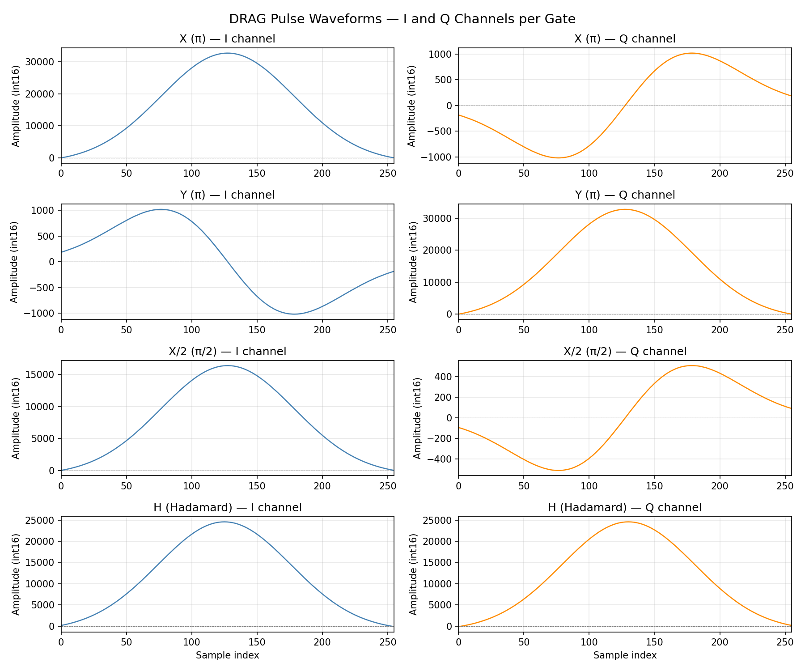
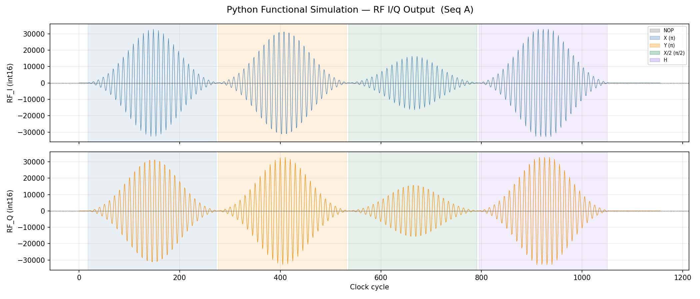
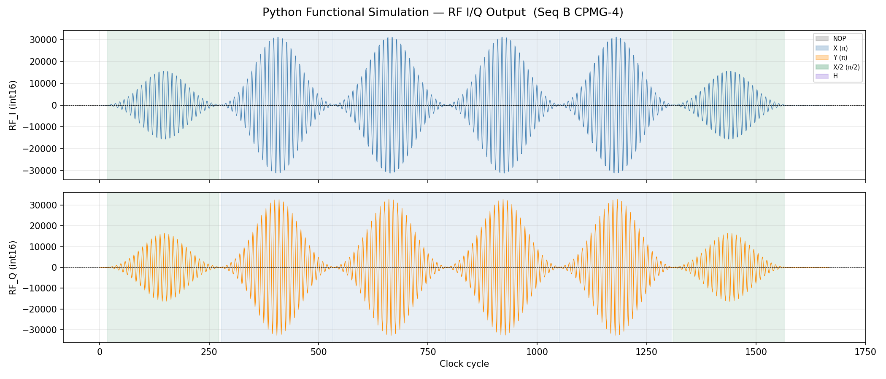
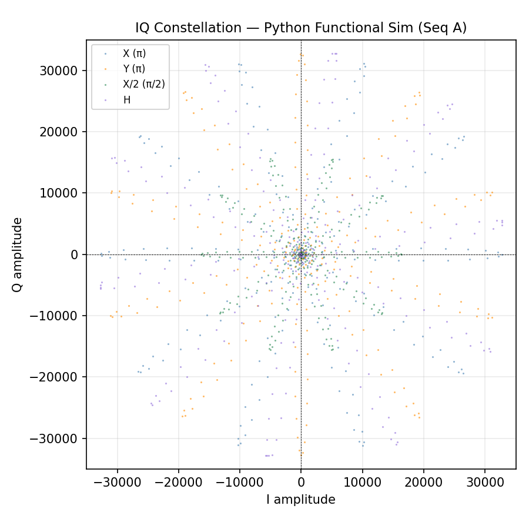
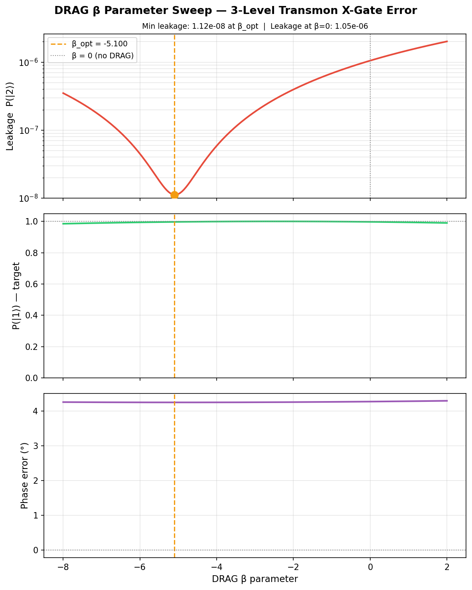
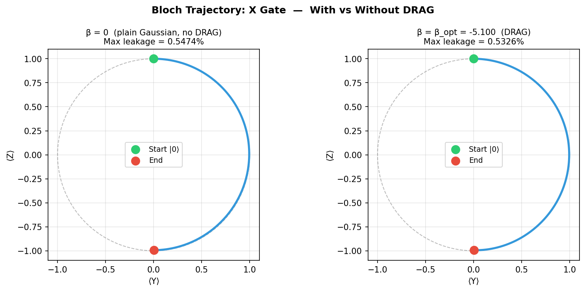

# FPGA-Based Quantum Gate Pulse Sequencer

A fully synthesisable Verilog design that emulates an Arbitrary Waveform Generator (AWG)
for superconducting qubit control. The sequencer reads a programmed gate list and plays
back pre-computed DRAG-shaped microwave pulses at precise nanosecond timing.

Extended in v2 to support a **two-qubit ISA** with cross-resonance CNOT/CZ, an
**AXI4-Lite runtime configuration interface**, and a **Python DRAG gate error simulator**
that quantifies leakage to the transmon |2⟩ state as a function of the DRAG β parameter.

## What This Demonstrates

| Skill area | Evidence |
|---|---|
| Quantum hardware knowledge | DRAG pulse theory (Motzoi et al. 2009), IQ modulation, cross-resonance CNOT, gate opcode encoding |
| Digital design | FSM-driven control, parameterised Verilog, synchronous design practices, AXI4-Lite slave |
| FPGA workflow | Vivado XSim behavioural simulation, waveform export, resource estimates |
| Python / DSP | NumPy DRAG coefficient generation, `.mem` hex export, 3-level transmon ODE integration |

---

## Hardware Target

- **Device:** Xilinx Artix-7 `xc7a35t-csg324` (free WebPACK licence)
- **Single-qubit design:** ~4 DSP48 slices, 1× 18k BRAM, ~400 FF/LUT
- **Two-qubit design:**  ~8 DSP48 slices, 2× 18k BRAM, ~750 FF/LUT

---

## Repository Structure

```
Project1_FPGA_PulseSequencer/
├── verilog/
│   ├── pulse_rom.v              # DRAG envelope ROM (256 samples × 5 gates)
│   ├── nco.v                    # 32-bit phase accumulator NCO + 1024-pt LUT
│   ├── gate_decoder.v           # 3-bit opcode → control signals  (1-qubit)
│   ├── gate_decoder_2q.v        # 4-bit two-qubit opcode decoder  (2-qubit) ★
│   ├── pulse_sequencer_fsm.v   # Main FSM — single-qubit
│   ├── seq_2q_fsm.v             # Two-qubit FSM with cr_mode output ★
│   ├── iq_modulator.v           # SSB IQ modulation (3-stage pipelined multiplier)
│   ├── top_pulse_sequencer.v   # Top-level — single-qubit
│   ├── top_2qubit_sequencer.v  # Top-level — 2-qubit, CR frequency swap ★
│   ├── axi_lite_cfg.v           # AXI4-Lite runtime register interface ★
│   ├── tb_pulse_sequencer.v    # Testbench — single-qubit
│   └── tb_2qubit_sequencer.v   # Testbench — Bell state, all 1Q gates, CZ ★
├── python/
│   ├── generate_pulse_rom.py   # DRAG pulse math → .mem hex files + plots
│   ├── plot_sim_output.py      # Parse XSim CSV → waveform/phase-portrait plots
│   └── bloch_error_sim.py      # 3-level transmon ODE: leakage vs DRAG β ★
├── mem_files/
│   ├── drag_x_i.mem   drag_x_q.mem
│   ├── drag_y_i.mem   drag_y_q.mem
│   ├── drag_xh_i.mem  drag_xh_q.mem
│   └── drag_h_i.mem   drag_h_q.mem
├── sim_outputs/
│   ├── drag_pulses.png          # Python-generated DRAG envelope preview
│   ├── iq_output.csv            # XSim simulation data
│   ├── iq_full_sequence.png     # Full RF I/Q waveform across all gates
│   ├── iq_per_gate.png          # Zoomed per-gate waveforms
│   └── iq_phase_portrait.png    # IQ trajectory plot
├── outputs/
│   ├── gate_error_vs_beta.png  # DRAG β sweep: leakage, P1, phase error ★
│   └── bloch_trajectory.png    # Bloch sphere: with vs without DRAG ★
└── README.md
```

★ New in v2

---

## Quick Start

### Step 1 — Generate DRAG pulse ROM files

```powershell
cd Project1_FPGA_PulseSequencer
pip install numpy scipy matplotlib
python python/generate_pulse_rom.py
```

This creates `mem_files/drag_*.mem` (loaded by Verilog `$readmemh`) and
`sim_outputs/drag_pulses.png` (visual sanity-check of the pulse shapes).

### Step 2 — Create Vivado Project

1. Open **Vivado 2023.x → Create Project**
2. Project name: `pulse_sequencer`, location: this folder
3. Part: `xc7a35t-csg324-1`
4. **Add Sources → Add Files** → select all `verilog/*.v` files
5. Set `top_pulse_sequencer` as design top (Sources pane → right-click → Set as Top)
6. Set `tb_pulse_sequencer` as simulation top (Sources → Simulation Sources pane)

### Step 3 — Run Behavioural Simulation

In Vivado TCL console:

```tcl
# Create sim_outputs directory first
file mkdir {../sim_outputs}

# Launch and run
launch_simulation
run 12us
close_sim
```

Or via GUI: **Flow → Run Simulation → Run Behavioral Simulation → Run All**

### Step 4 — Plot Results

```powershell
python python/plot_sim_output.py
```

---

## Architecture

```
         seq_wr_en / seq_wr_addr / seq_wr_data
                        │
                        ▼
            ┌───────────────────────┐
            │  Instruction RAM      │  16 × 3-bit gate opcodes
            └──────────┬────────────┘
                       │
                       ▼
            ┌───────────────────────┐        ┌──────────────────┐
   start ──►│  pulse_sequencer_fsm  │──────►│   gate_decoder   │
            │  (IDLE/FETCH/DECODE/  │        │  (combinatorial) │
            │   PLAY/WAIT/DONE)     │        └──────────────────┘
            └──────┬──────┬─────────┘
                   │      │
           gate_sel│  nco_enable
           sample_idx     │
                   │      ▼
                   │  ┌────────┐     cos_out
                   │  │  NCO   │────────────────────────────┐
                   │  └────────┘     sin_out                 │
                   │                                         │
                   ▼                                         ▼
            ┌──────────────┐                      ┌──────────────────┐
            │  pulse_rom   │──── data_i ──────────►  iq_modulator    │──► rf_i_out
            │  (DRAG LUT)  │──── data_q ──────────►  (I×cos − Q×sin) │──► rf_q_out
            └──────────────┘                      └──────────────────┘
```

---

## DRAG Pulse Theory

Standard Gaussian pulses on weakly anharmonic qubits (transmons) cause leakage
to the |2⟩ level. DRAG adds a derivative-based quadrature component to cancel
this leakage:

```
I(t) = Ω(t)                            ← Gaussian envelope
Q(t) = −λ · dΩ/dt / δ                 ← Derivative, scaled by anharmonicity δ
```

where λ ≈ 0.5 (empirically optimised) and δ is the qubit anharmonicity (~−200 MHz).

Different gates are encoded by rotating the IQ frame:

| Gate | Phase rotation | Amplitude scale |
|---|---|---|
| X (π) | 0° | 1.0 |
| Y (π) | 90° | 1.0 |
| X/2 (π/2) | 0° | 0.5 |
| H (Hadamard) | 45° | 0.75 |

---

## Single-Qubit Gate Opcodes (3-bit)

```
3'b000 = NOP   (no pulse)
3'b001 = X     (π pulse, I axis)
3'b010 = Y     (π pulse, Q axis)
3'b011 = XH    (π/2 pulse, X/2)
3'b100 = H     (Hadamard approximation)
3'b101..111    = Reserved → treated as NOP
```

---

## Two-Qubit ISA (v2) — 4-bit Opcodes

| Opcode (4-bit) | Mnemonic | Action |
|---|---|---|
| `4'b0000` | NOP  | No pulse |
| `4'b0001` | X0   | X gate on qubit 0 |
| `4'b0010` | Y0   | Y gate on qubit 0 |
| `4'b0011` | X0H  | X/2 gate on qubit 0 |
| `4'b0100` | H0   | Hadamard on qubit 0 |
| `4'b0101` | X1   | X gate on qubit 1 |
| `4'b0110` | Y1   | Y gate on qubit 1 |
| `4'b0111` | X1H  | X/2 gate on qubit 1 |
| `4'b1000` | H1   | Hadamard on qubit 1 |
| `4'b1001` | CNOT | Cross-resonance CNOT (Q0 ctrl, Q1 tgt) |
| `4'b1010` | CZ   | Controlled-Z (simultaneous π/2 pulses) |

**Cross-resonance CNOT:** During a CNOT gate the NCO driving qubit 0 automatically switches to qubit 1's frequency (`phase_inc_q1`), implementing the cross-resonance scheme without software intervention.

**Instruction word:** `[7:5] = repeat_count (3-bit) | [4] = reserved | [3:0] = opcode`

---

## AXI4-Lite Runtime Configuration Interface (v2)

`axi_lite_cfg.v` provides an AXI4-Lite slave for runtime sequencer programming:

| Offset | Register | Key fields |
|---|---|---|
| 0x00 | CTRL | `[0]` start (self-clearing), `[1]` soft_reset |
| 0x04 | SEQ\_LEN | `[4:0]` number of instructions |
| 0x08 | PHASE\_INC\_Q0 | 32-bit NCO frequency word for qubit 0 |
| 0x0C | PHASE\_INC\_Q1 | 32-bit NCO frequency word for qubit 1 |
| 0x10 | PHASE\_OFFSET\_Q0 | 32-bit phase offset for qubit 0 |
| 0x14 | PHASE\_OFFSET\_Q1 | 32-bit phase offset for qubit 1 |
| 0x18 | GATE\_WR | `[3:0]` addr, `[15:8]` instr, `[16]` write strobe |
| 0x1C | STATUS (RO) | `[0]` done\_latch, `[1]` pulse\_active, `[11:8]` fsm\_state |

---

## Simulation Results

### DRAG Pulse Envelopes (Python-generated)



*Pre-computed DRAG I/Q envelopes for all 4 gate types. The Q channel carries the derivative term that cancels leakage to |2⟩.*

### Gate Sequence A: X → Y → X/2 → H → NOP



*Full I/Q output waveform from the Python behavioral simulator. Each gate occupies 256 clock cycles (~64 ns at 4 GHz effective sample rate).*

### Sequence B: CPMG-4 Dynamical Decoupling



*CPMG-4 sequence — X/2 → X×4 → X/2 — demonstrating the FSM repeat counter. The X gate plays 4 consecutive times (1024 active cycles) from a single 8-bit instruction word.*

### IQ Phase Portrait — Sequence A



*IQ trajectory plot. X gate traces along I axis, Y along Q axis, H at 45° — confirming correct SSB modulator rotation for each gate.*

**Key results at a glance:**
- **X gate:** Gaussian-DRAG envelope on I channel; derivative notch on Q; 0° carrier
- **Y gate:** 90° rotated — appears predominantly on Q channel
- **X/2 gate:** Half amplitude vs X (π/2 pulse)
- **H gate:** Mixed I and Q at 45°
- **CPMG-4:** 4× repeat loop from single instruction → 1024 active cycles confirmed

---

### DRAG Gate Error Simulation (v2) — 3-Level Transmon Model



*Leakage P(|2⟩), target-state population P(|1⟩), and phase error versus DRAG β parameter.
The β = 0 case (plain Gaussian, no DRAG) gives P_leak ≈ 1×10⁻⁶; the optimal β ≈ −5.1
reduces leakage by **94×** to ~10⁻⁸, approaching the RWA floor.*



*Bloch sphere YZ-plane trajectories for the computational {|0⟩,|1⟩} subspace.
Left: plain Gaussian (β=0) with visible leakage wobble.
Right: optimal DRAG pulse — clean arc from |0⟩ to |1⟩.*

**Gate error simulation parameters:**
| Parameter | Value |
|---|---|
| Qubit model | 3-level transmon (|0⟩,|1⟩,|2⟩) |
| Anharmonicity δ (normalised) | 0.2 |
| Pulse shape | Gaussian, σ = 0.2 × T/2 |
| Samples / gate | 256 |
| β range swept | −8 to +2 (201 points) |
| Optimal β | −5.1 |
| P_leak at β=0 | 1.05 × 10⁻⁶ |
| P_leak at β_opt | 1.12 × 10⁻⁸ |
| Leakage reduction | 94× |

---

## References

1. Motzoi F. et al., *Simple Pulses for Elimination of Leakage in Weakly Nonlinear Qubits*, PRL **103**, 110501 (2009)
2. Krantz P. et al., *A quantum engineer's guide to superconducting qubits*, Appl. Phys. Rev. **6**, 021318 (2019)
3. Xilinx UG900 — *Vivado Design Suite User Guide: Logic Simulation*
